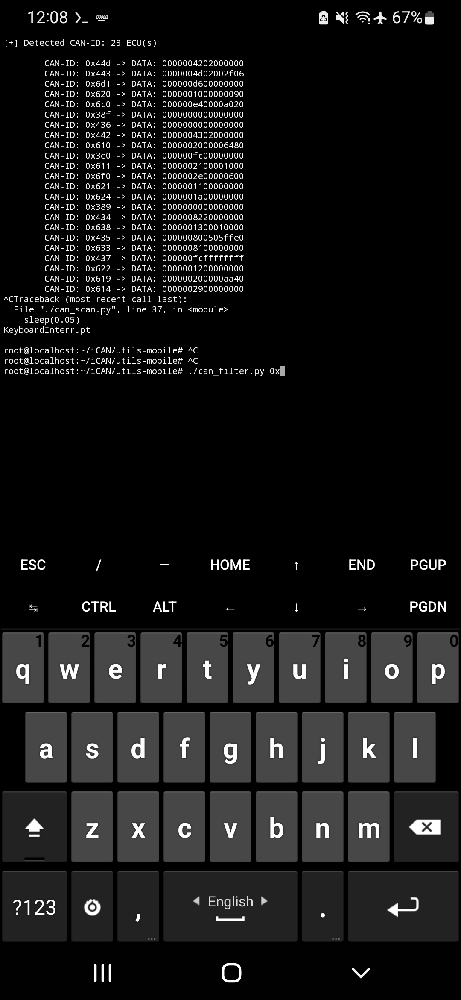

# CAN Bus Hacking with ESP8266 and MCP2515

## Overview

This project explores the world of Controller Area Network (CAN) bus hacking, using an ESP8266 NodeMCU controller and an MCP2515 CAN Controller module. The CAN bus is commonly found in automotive and industrial systems, and understanding how to interface with it is essential for various applications, from diagnostics to customizations.

This project provides an introduction to the hardware and software required for CAN bus hacking, along with sample code and scripts for communication with the CAN bus.

## Hardware Components

### 1. ESP8266 NodeMCU Controller

The ESP8266 NodeMCU is a versatile microcontroller with built-in Wi-Fi capabilities. In this project, it serves as the interface between your PC or mobile device and the MCP2515 CAN Controller.

### 2. MCP2515 CAN Controller Module

The MCP2515 is a widely-used CAN Controller module. It allows the ESP8266 NodeMCU to communicate with the CAN bus, enabling you to send and receive messages.

## Software Components

### 1. Arduino IDE

To program the ESP8266 NodeMCU, you can use the Arduino IDE. You'll need the necessary libraries and drivers to set up the development environment.

### 2. Python Scripts

This project includes Python scripts for both Linux PCs and mobile devices. These scripts facilitate communication with the ESP8266 NodeMCU and the CAN bus.

## Setting up the Hardware

1. Connect the MCP2515 CAN Controller module to the ESP8266 NodeMCU. Make sure to connect the required pins, including the Chip Select (CS) pin.

2. Power the MCP2515 module and ESP8266 NodeMCU.

## Arduino Code

The provided Arduino code allows you to initialize and configure the CAN Controller. You can choose between Normal Mode and Loopback Mode, depending on your goals. The code also includes functions for sending and receiving CAN messages.

## Python Scripts

Python scripts are available for both Linux PCs and mobile devices. These scripts establish a connection with the ESP8266 NodeMCU and enable you to send and receive CAN messages. They are designed to be user-friendly and accessible.

## Usage

1. Upload the Arduino code to the ESP8266 NodeMCU using the Arduino IDE.

2. Run the Python script on your PC or mobile device.

3. Configure the script to connect to the ESP8266 NodeMCU via Wi-Fi.

4. Start receiving CAN messages.

5. You can modify the project to send CAN messages (I couldnt do sufficent testing on that because the car wasnt mine, So yeah)

## License

This project is open-source and released under the [MIT License](LICENSE). You are welcome to modify, contribute, or use it for educational and non-malicious purposes.

**Note**: Hacking into CAN bus systems without proper authorization may be illegal and unethical.
